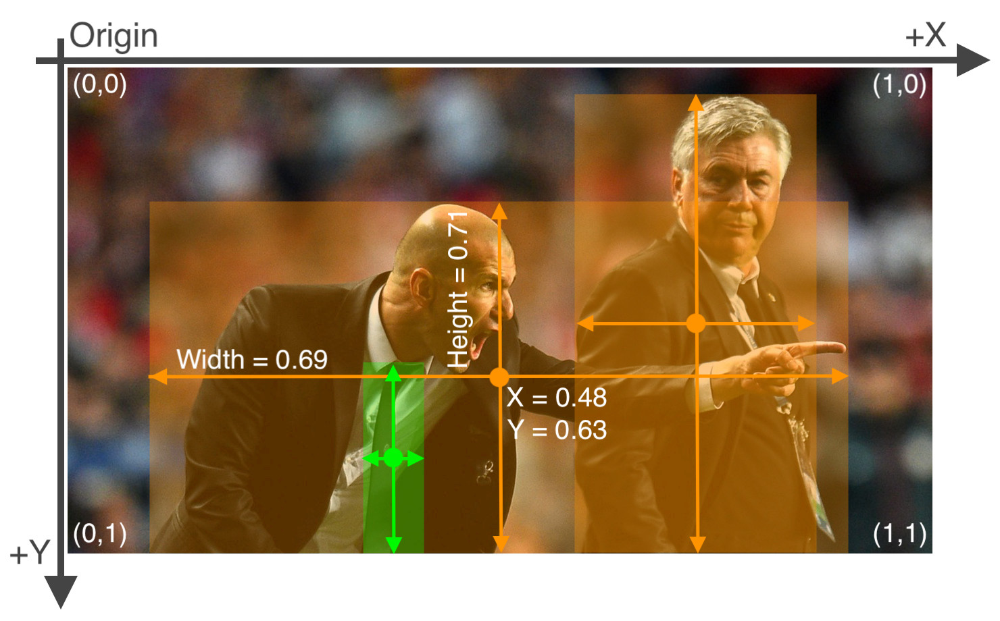

# Cone detection
This tutorial will show how to work with the YOLOv5 model for both stereocamera and lidar.
## Setup
_**It's higly recommended to take a look at the notebooks for a better understanding of the workflow.**_
### Repositories and requirements
Before working with the project, remember to clone the sensory group repository.
```bash
git clone --recursive https://github.com/unipi-smartapp-2021/sensory-cone-detection
```
Clone the official yolov5 repository too, or just use the model from the  ```sensory-cone-detection/sensory/scripts/yolov5``` directory. **Warning:** the local YOLOv5 model may not work if it is not up to date with the latest version.
```bash
git clone https://github.com/ultralytics/yolov5
```
Install the model requirements for working correctly.
```bash
pip install -r path_to_yolov5_directory/requirements.txt
```
### Managing the dataset
Upload the dataset in the apposite directories following what is suggested in the official documentation from the YOLOv5 team (https://github.com/ultralytics/yolov5/wiki/Train-Custom-Data), section 1.3, or use ```manage_dataset.py``` to let it do the entire work.
```bash
python manage_dataset.py --dataset dataset --path path_to_your_dataset_directory
```
For the previous command you can use the following arguments:
- _--dataset_, where the non-split dataset is located. 
- _--path_, where to save the split dataset.
- _--copy_, copy the records, if not defined it will move each record from the source directory to the target one.
- _--grayscale_, convert the images into grayscale ones.
- _--split_, split the dataset into training, validation and test sets (default is 80%, 10% and 10%).

Each image has one text file with a single line for each bounding box. The format of each row is

**class_id, center_x, center_y, width, height**

where fields are space delimited, and the coordinates are normalized from zero to one.


The datasets used during the development resulted too big to be uploaded on GitHub, therefore we opted for hosting the datasets on a Google Drive shared by the group. We encourage to build your own dataset if you're interested in implementing the model. 
  
After splitting the dataset into the usual train, validation and test splits, the latter being not strictly mandatory for YOLOv5, three more files, naturally created by ```manage_dataset.py```, should be manually created if lacking. They are, respectively: ```train.txt```, ```validation.txt``` and ```test.txt```, and contain the paths to the respective splits of the dataset within them.

### Setting up the yaml file
Modify the _.yaml_ file to your needs: this is required to work with YOLOv5 on a custom dataset. The following code refers to the _.yaml_ file required by YOLOv5 to work with the images coming from the stereocamera. 
```yaml
# Train/val/test sets as 1) dir: path/to/imgs, 2) file: path/to/imgs.txt, or 3) list: [path/to/imgs1, path/to/imgs2, ..]
path: path_to_your_camera_dataset_directory # dataset root dir
train: train.txt # train images (relative to 'path')
val: validation.txt # val images (relative to 'path')
test: test.txt # test images (optional)
# Classes
nc: 4 # number of classes
names: ['big','orange','yellow','blue'] # class names
```
### Importing the model
It's recommended by the YOLOv5 team to **work with a pretrained model** and not building it from scratch due to how this would require to configure it entirely.

The weights of the various pretrained models (base, small, large etc.) can be found on the release page (https://github.com/ultralytics/yolov5/releases) from the YOLOv5 team. The following is an example of importing one of them:
```python
import requests
url = 'https://github.com/ultralytics/yolov5/releases/download/v6.0/yolov5s.pt'
r = requests.get(url, allow_redirects=True)
open('yolov5s.pt', 'wb').write(r.content)
```
## Training
To train the model we absolutely suggest you to follow this guide https://github.com/ultralytics/yolov5/blob/master/tutorial.ipynb. The main arguments of the ```train.py``` method are:
- _--img_, image size.
- _--batch_, batch size.
- _--epochs_, number of epochs.
- _--data_, the yaml file.
- _--weights_, the model weights.
- _--cache_, to save a cache file of the train and validation sets.
- _--project_, where to save the results.
```bash
python yolov5/train.py --img 640 --batch 16 --epochs 10 --data path/to/your_yaml.yaml --weights yolov5s.pt
```
Use ```--cache``` to cache the train and validation sets before starting the training and use ```--project``` to specify where to save the results. The directory used to store the results will also contain the last and best weights for the model.
## Evaluation
The evaluation on labeled data (the validation or test set specified on your _.yaml file_) is done by using ```val.py```.
```bash
python yolov5/val.py --weights best.pt --img 640 --conf 0.5 --data path/to/your_yaml.yaml --task test
```
At the end of the training, the freshly computed weights should be in ```/runs/train/exp/weights```, otherwise, ```--weights``` needs to receive the path of the weights to be used during evaluation.

The ```val.py``` argument ```--task``` defines the split to be used for the evaluation of the model depending on the values _test_ or _val_.

### Inference
```detect.py``` is instead the method used when dealing with non-labeled data, it is therefore used during the various driverless competitions.
```bash
python yolov5/detect.py --weights best.pt --img 640 --conf 0.5 --source path_to_your_image.png
```
For both _val.py_ and _detect.py_, the results are stored by using _project_. Both methods support the following arguments:
- _--save-txt_, save the labels (useful to locate the cones).
- _--nosave_, don't save the labeled image.
- _--exist-ok_, to use the same directory for the results.
- _--project_ runs/detect, where to save the results.
- _--hide-labels_, don't show the labels on the detected cones.
- _--hide-conf_, don't show the confidence on each detected cone.

## Use the model from the PyTorch hub
It is also possible to load the trained model from PyTorch Hub and directly use it to perform inference on custom data (more details on https://github.com/ultralytics/yolov5/issues/36).
The following snippet displays how to perform such endeavour:
You can also try to inference on your model by using it from the pytorch hub, for more details follow this guide https://github.com/ultralytics/yolov5/issues/36.
```python
import torch
model = torch.hub.load('ultralytics/yolov5', 'custom', path=your_weights)
results = model(path_to_image)
```
